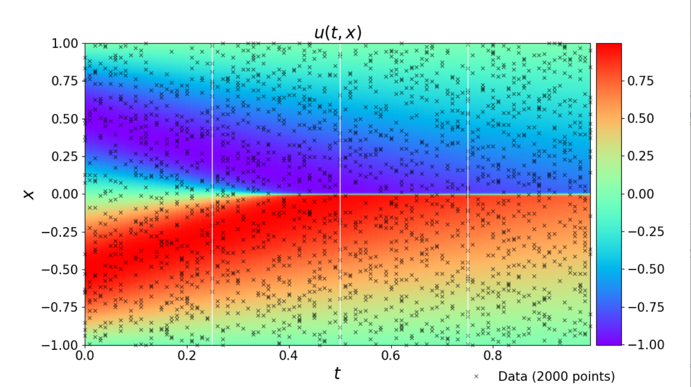
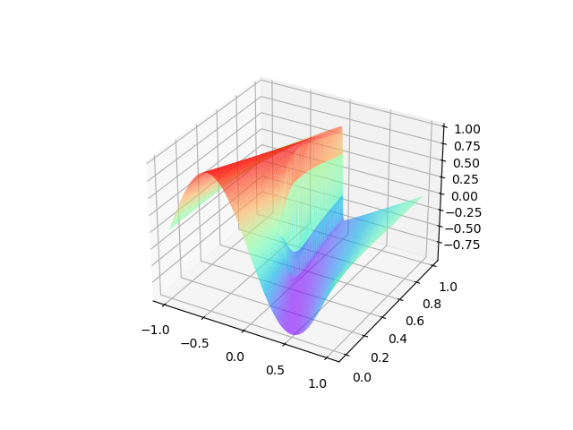

# PINNS(Physics-informed Neural Networks)
This is a simple implementation of the Physics-informed Neural Networks (PINNs) using oneflow.


-------------------------------------------
## Attribute

**Original Work**: *Maziar Raissi, Paris Perdikaris, and George Em Karniadakis*

**Github Repo** : https://github.com/maziarraissi/PINNs

**Link:** https://github.com/maziarraissi/PINNs/tree/master/appendix/continuous_time_identification%20(Burgers)

@article{raissi2017physicsI,
  title={Physics Informed Deep Learning (Part I): Data-driven Solutions of Nonlinear Partial Differential Equations},
  author={Raissi, Maziar and Perdikaris, Paris and Karniadakis, George Em},
  journal={arXiv preprint arXiv:1711.10561},
  year={2017}
}

@article{raissi2017physicsII,
  title={Physics Informed Deep Learning (Part II): Data-driven Discovery of Nonlinear Partial Differential Equations},
  author={Raissi, Maziar and Perdikaris, Paris and Karniadakis, George Em},
  journal={arXiv preprint arXiv:1711.10566},
  year={2017}
}

-------------------------------------------

## Dependencies

Major Dependencies:

 - ***oneflow (for oneflow Implementation)***: ```pip install --upgrade oneflow``

Peripheral Dependencies:
 
 - ***numpy***: ```pip install numpy```
 - ***seaborn***: ```pip install seaborn```
 - ***matplotlib***: ```pip install matplotlib```


### 1. Training dataset

The training data has already in the folder `data`, present in file burgers_shock.mat

#### dataset:




### 2. Run Oneflow Training and Inference Script

To get the image of Cross-section of the Extra General solution and the Predicted General solution:

```
python general_solution.py
```

#### Extra and Prediction:


To get the image of Predicted General solution from a 3D perspective:

#### Predictied General Solution:



```
python pinns_oneflow.py
```
